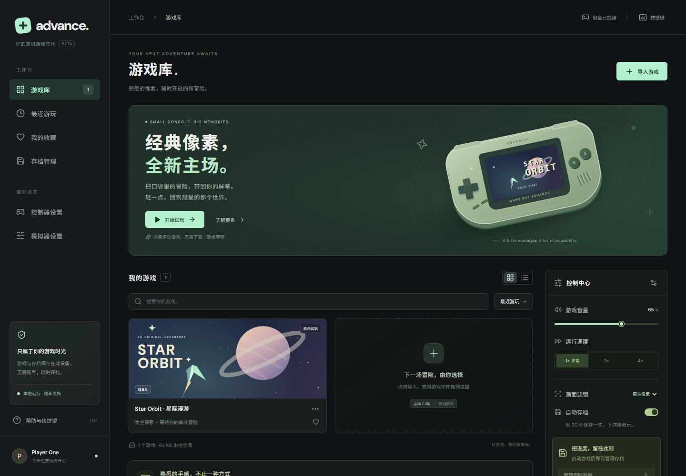
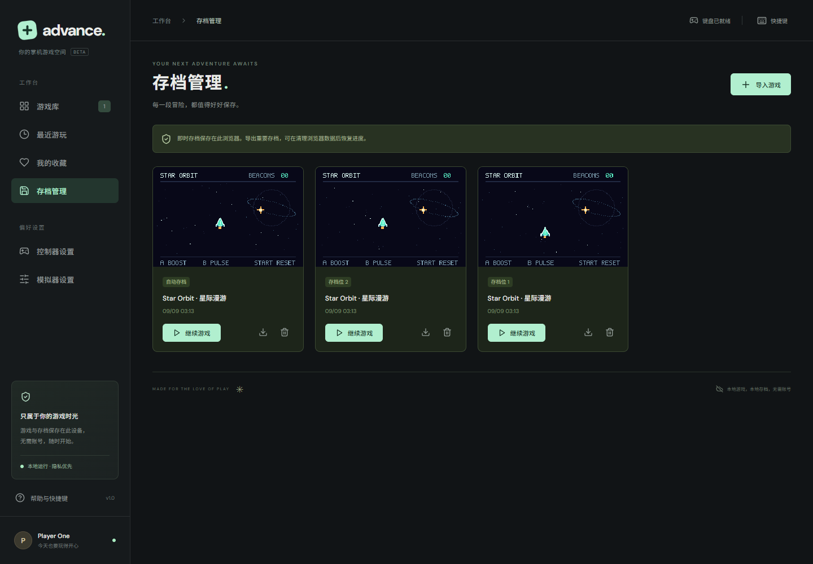
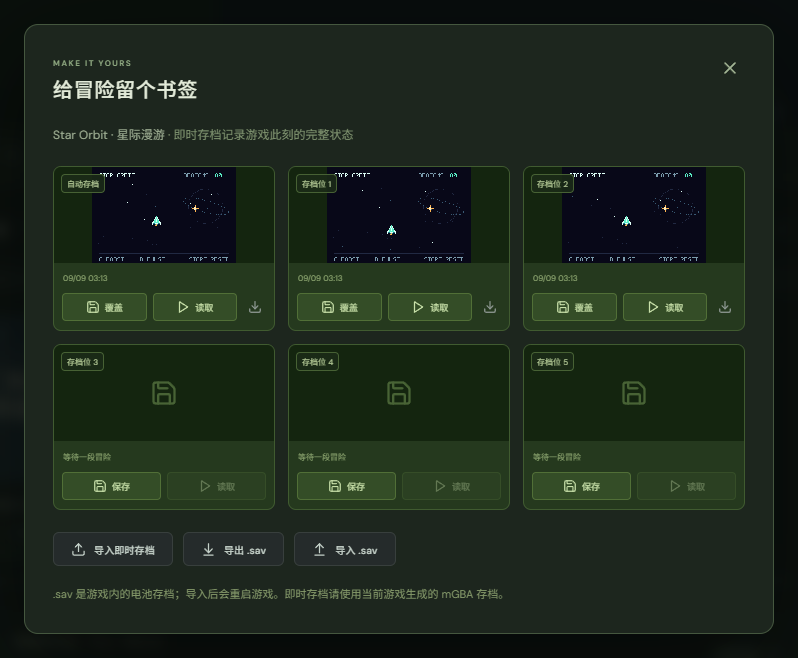
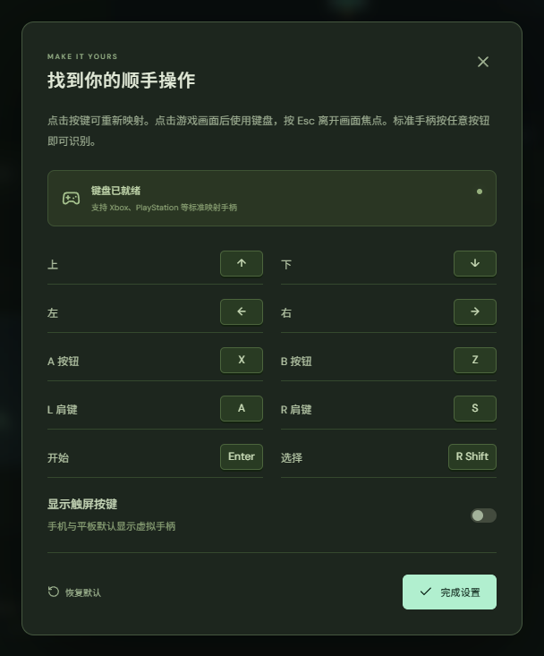
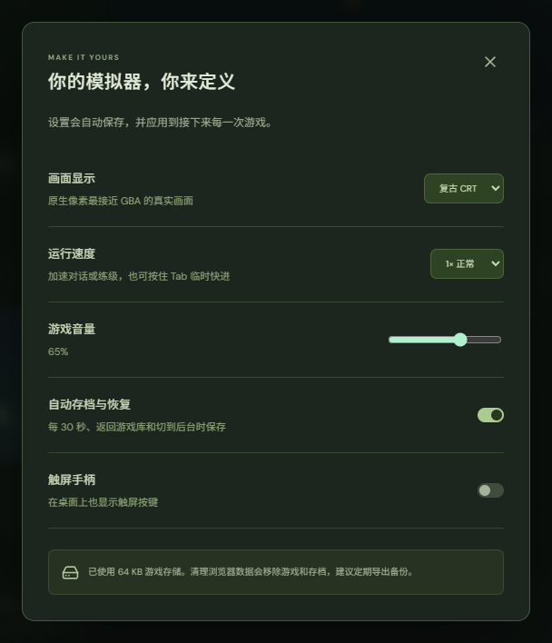
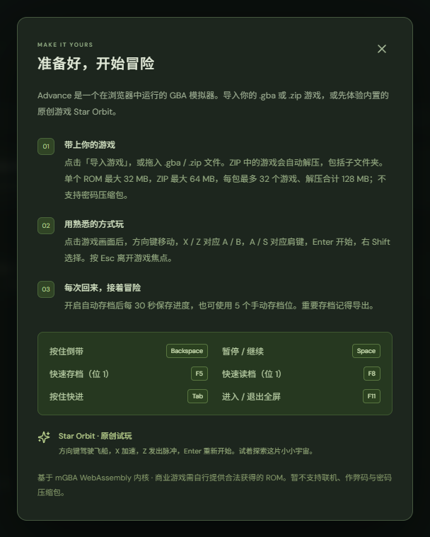
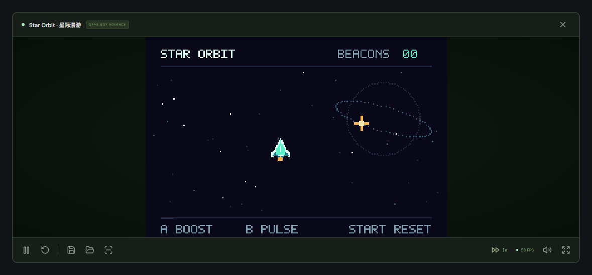
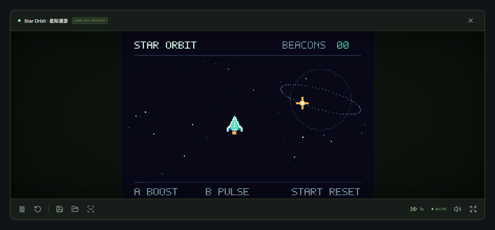
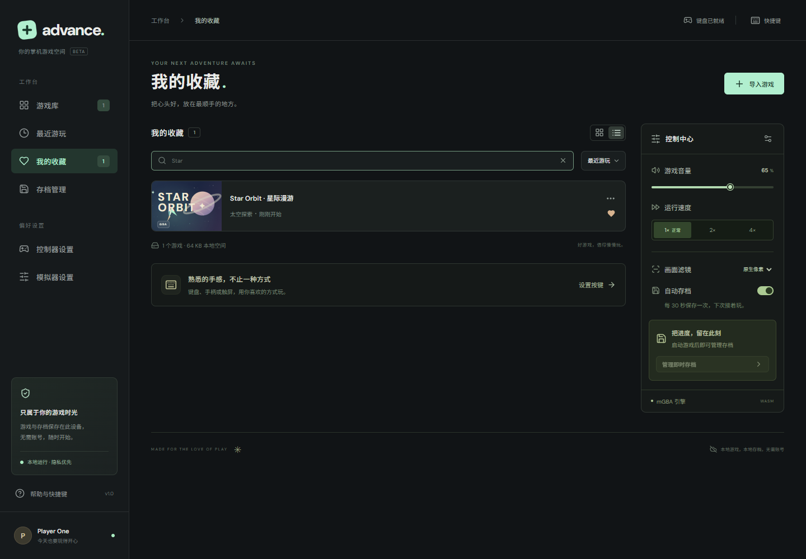
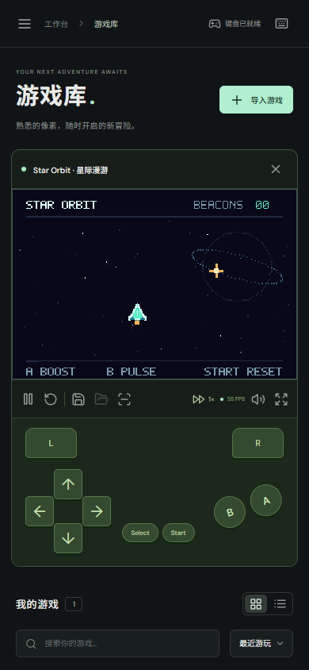

<div align="center">


# Advance

**Your space for handheld games.**

A modern GBA emulator for the browser, powered by a real mGBA WebAssembly core.

[](LICENSE)
[](public/emulator/NOTICE.md)
[](https://react.dev/)
[](https://www.typescriptlang.org/)

[简体中文](README.md) · [Features](#features) · [Quick start](#quick-start) · [Deployment](#deployment) · [Roadmap](ROADMAP.md) · [Contributing](CONTRIBUTING.md)

</div>



Advance combines a dark, mint-accented interface with a local game library, save states and keyboard, gamepad and touch controls. The interface is currently in Chinese and adapts to desktop, tablet and phone screens. The bundled mGBA core runs actual GBA code, graphics and audio.

No account or user-supplied BIOS is required. Try **Star Orbit**, an original, MIT-licensed homebrew game included in the repository. No commercial game ROMs are distributed with this project.

## Screenshots

All screenshots show the real application. Game footage comes from the included original homebrew ROM. Alongside the library overview above, the gallery covers saves, controls, settings, help and mobile play.

### 1. Save manager and save states

The save manager collects automatic and manual states across games, with screenshot previews, timestamps and actions to resume, export or delete a state.



The in-game save panel provides **one automatic slot and five manual slots**. Save, load, import and export states, or back up and import a game's battery save (`.sav`).

<p align="center">
  <a href="docs/images/save-states.png"></a>
</p>

### 2. Controller and emulator settings

| Controller settings | Emulator settings |
| :---: | :---: |
|  |  |
| Click a key to remap it, restore default bindings or toggle on-screen controls. | Choose display style, 1× / 2× / 4× speed, volume and automatic saves. Preferences are saved automatically. |

### 3. Help and keyboard shortcuts

The built-in guide explains GBA / ZIP imports, keyboard controls and saves, with a quick reference for pause, quick save/load, fast-forward, rewind and fullscreen.

<p align="center">
  <a href="docs/images/help-shortcuts.png"></a>
</p>

### 4. Gameplay and display styles

| Native pixels | Retro CRT |
| :---: | :---: |
|  |  |
| Playback, quick save/load, speed, screenshot and fullscreen controls sit below the screen. | Switch to CRT scanlines in settings, or choose native pixels or smooth scaling. |

### 5. Favorites and library list

Keep favorite games together. List view shows game details and play history, with search, sorting and launch controls available.



### 6. Mobile touch controls

The mobile layout includes a D-pad, A / B, L / R and Start / Select touch buttons, alongside an accessible playback toolbar.

<p align="center">
  <a href="docs/images/mobile-player.png"></a>
</p>

## Features

- **Real emulation:** mGBA WASM graphics, audio and SRAM / Flash / EEPROM battery saves.
- **Local library:** multiple-file and drag-and-drop imports, search, sorting, favorites, recent play, playtime, grid and list views.
- **ZIP support:** import `.gba` files from nested folders, with content-based deduplication that preserves existing progress.
- **Save states:** five manual slots and one automatic slot, screenshot previews, quick save/load and import/export.
- **Progress management:** automatic states every 30 seconds and when returning to the library or hiding the page, when enabled; `.sav` import/export.
- **Playback:** pause, resume, reset, fullscreen, 1× / 2× / 4× speed, hold-to-fast-forward, hold-to-rewind, volume and mute.
- **Controls:** remappable keyboard, standard-mapped gamepads and on-screen touch buttons.
- **Display:** pixel, smooth and CRT scanline filters; screenshots from the real core framebuffer.
- **Local data:** IndexedDB stores ROMs, library metadata and saves; localStorage stores preferences. Runtime assets are bundled without an external CDN dependency.
- **Homebrew demo:** reproducible ARM code with double-buffered graphics, native input, PSG audio and SRAM saves.

## Quick start

Recommended: **Node.js 24** and **pnpm 11.19.0**. Minimum Node.js version: 22.18. If pnpm is not installed, run `npm install --global pnpm@11.19.0` first.

```sh
git clone https://github.com/hehuang139/gba-emu.git
cd gba-emu
pnpm install --frozen-lockfile
pnpm dev
```

Open [http://localhost:5173](http://localhost:5173). Click **「开始试玩」** to start the demo, or import your own `.gba` / `.zip` file.

In Star Orbit, move toward the gold beacons to collect points. Hold `X` to boost, press `Z` to emit a pulse, and press `Enter` to reset. See the [demo documentation](public/demo/README.md) for its source and build instructions.

## Controls

Click the game screen to give it keyboard focus. Use `Esc` or `Shift + Tab` to return focus to the interface. GBA button mappings can be changed in controller settings.

| Action | Default key |
| --- | --- |
| D-pad | Arrow keys |
| GBA A / B | `X` / `Z` |
| GBA L / R | `A` / `S` |
| Start / Select | `Enter` / Right `Shift` |
| Pause / resume | `Space` |
| Save / load manual slot 1 | `F5` / `F8` |
| Temporary 2× speed | Hold `Tab` |
| Rewind | Hold `Backspace` |
| Fullscreen | `F11` |

Standard-mapped gamepads support the D-pad and left stick. Press a gamepad button once to make it visible to the browser. Nonstandard gamepad mappings are not supported yet.

## Import and save limits

Single `.gba` files must be between 192 bytes and 32 MiB. ZIP files may be up to 64 MiB, contain up to 32 games and expand to at most 128 MiB of ROM data. Stored and Deflate compression are supported; encrypted, ZIP64, split and nested ZIP archives are not. Imports verify sizes and CRC values and ignore documentation and macOS metadata.

Battery saves (`.sav`) contain a game's own saved progress. Save states capture the full emulation state and require the matching game and a compatible mGBA version. Clearing site data, ending an incognito session or browser storage eviction can delete local files, so export important saves. Force-closing the browser can lose progress since the last automatic save.

## Deployment

```sh
pnpm build
pnpm preview
```

The output is in `dist/`; local preview runs at [http://localhost:4173](http://localhost:4173).

**The threaded WASM core requires HTTPS or localhost and cross-origin isolation.** Serve these response headers:

```http
Cross-Origin-Opener-Policy: same-origin
Cross-Origin-Embedder-Policy: require-corp
```

Vite development and preview servers already set them. The included `public/_headers` supports compatible Netlify / Cloudflare Pages deployments. Other hosts must configure the headers explicitly. Serve the core and application from the same origin; the current build assumes a site-root deployment.

Plain HTTP on a LAN address and hosts without the required headers will not run the core. Default GitHub Pages hosting does not support these custom response headers and is not a direct deployment target for this version. Browsers need SharedArrayBuffer, WebAssembly threads, WebGL and IndexedDB. PWA installation and reliable offline use are not implemented yet.

## Development and testing

```sh
pnpm test
pnpm build
pnpm exec playwright install chromium

# Keep pnpm dev running in another terminal
pnpm test:engine
pnpm test:ui
pnpm test:zip
pnpm test:saves
```

Tests cover storage and import validation, real-core execution, input, state restoration, rewind, SRAM, worker cleanup, library interactions, ZIP imports, save isolation and mobile controls. Browser tests default to `http://127.0.0.1:5173`; use `ENGINE_TEST_URL` or `UI_TEST_URL` to override it. The engine suite requires the Vite development server because its test harness is not included in production builds. `BROWSER_EXECUTABLE_PATH` can select an installed Chromium / Chrome / Edge binary.

The [contributing guide](CONTRIBUTING.md) describes the project structure and test workflow in more detail. English Issues and PRs are welcome.

## Roadmap and compatibility

Planned work includes a browser compatibility matrix, customizable gamepad and touch controls, bulk backup/restore, PWA support, UI localization and more redistributable homebrew tests. See the [full roadmap](ROADMAP.md) for scope and acceptance goals and the [changelog](CHANGELOG.md) for release history. Unchecked items are plans, not shipped features or release-date commitments.

Link play, cheats, cloud sync and GB / GBC are not supported. The project has not been tested against a comprehensive commercial ROM library; individual game compatibility still needs verification.

## Acknowledgments and license

Thanks to [mGBA](https://mgba.io/) by Jeffrey Pfau and contributors, and the [mgba-wasm port](https://github.com/thenick775/mgba) by Nicholas VanCise and contributors, for making the emulator possible. The interface and tooling also use [React](https://react.dev/), [TypeScript](https://www.typescriptlang.org/), [Vite](https://vite.dev/), [Lucide](https://lucide.dev/), [fflate](https://github.com/101arrowz/fflate), [DM Sans](https://github.com/googlefonts/dm-fonts), [Playwright](https://playwright.dev/) and [fake-indexeddb](https://github.com/dumbmatter/fakeIndexedDB).

Application code and original demo content are licensed under [MIT](LICENSE). **Third-party components retain their own licenses:** mGBA / mgba-wasm and the local core bridge modifications use MPL-2.0; DM Sans uses SIL OFL 1.1. See [THIRD_PARTY_NOTICES.md](THIRD_PARTY_NOTICES.md) and the [core provenance](public/emulator/NOTICE.md) before redistributing.

Game Boy Advance is a trademark of Nintendo. This independent project is not affiliated with or endorsed by Nintendo.
