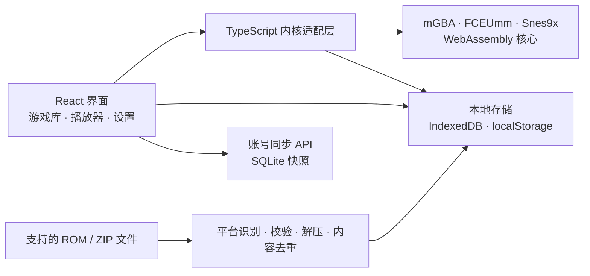

<div align="center">


# Advance

**你的掌机游戏空间。**

一个现代、美观的 GBA、GB、GBC、FC / NES 与 SFC / SNES 浏览器模拟器。真实 WebAssembly 内核，本地游戏库，随时保存，再次出发。

[](LICENSE)
[](public/emulator/NOTICE.md)
[](https://react.dev/)
[](https://www.typescriptlang.org/)

[效果预览](#效果预览) · [功能特性](#功能特性) · [快速开始](#快速开始) · [部署](#构建与部署) · [Roadmap](ROADMAP.md) · [参与贡献](CONTRIBUTING.md) · [English](README.en.md)

</div>


Advance 把熟悉的掌机与经典主机体验带到浏览器：整理 GBA、GB、GBC、FC / NES 与 SFC / SNES 游戏，连接手柄、回到刚才的存档，或在手机上继续探索。界面采用中文设计，适配桌面、平板与手机；游戏由 **mGBA、FCEUmm 与 Snes9x WebAssembly** 核心实际执行。

无需账号也能使用本地游戏库，并且不需要自行提供 BIOS。可选账号会把 ROM、游戏内存档与即时存档同步到自托管服务，登录后可在新的浏览器中恢复。仓库附带 MIT 授权的原创 GBA 小游戏 **Star Orbit · 星际漫游**，启动后点击「开始试玩」即可体验。商业游戏 ROM 不随项目分发。

## 效果预览

以下均为实际界面截图，游戏画面来自仓库内的原创试玩 ROM。除上方游戏库首页外，还展示存档、控制器、设置、帮助和移动端等主要界面。

### 1. 存档管理与即时存档

存档管理页集中展示各游戏的自动与手动存档，包括画面预览、保存时间，以及继续游戏、导出和删除操作。


游戏内的即时存档面板提供 **1 个自动槽与 5 个手动槽**，可保存、读取、导入和导出即时存档，也可备份或导入游戏内的 `.sav` 存档。

<p align="center">
  <a href="docs/images/save-states.png"></a>
</p>

### 2. 控制器与模拟器设置

|                                        控制器设置                                        |                                           模拟器设置                                           |
| :--------------------------------------------------------------------------------------: | :--------------------------------------------------------------------------------------------: |
|  |  |
|        配置键盘与手柄映射、摇杆死区，以及触屏布局、大小和不透明度；支持恢复默认。        |              选择画面风格、1× / 2× / 4× 速度、游戏音量与自动存档，偏好自动保存。               |

### 3. 帮助与快捷键

内置使用指南涵盖各支持平台与 ZIP 导入、键盘操作和存档方式，并集中列出暂停、快速存取档、快进、倒带和全屏快捷键。

<p align="center">
  <a href="docs/images/help-shortcuts.png"></a>
</p>

### 4. 游戏播放与画面风格

|                                   原生像素                                    |                                   复古 CRT                                   |
| :---------------------------------------------------------------------------: | :--------------------------------------------------------------------------: |
|  |  |
|          播放控制、快速存取档、倍速、截图和全屏操作集中在画面下方。           |          在设置中切换 CRT 扫描线，也可选择原生像素或柔和平滑显示。           |

### 5. 收藏与游戏库列表

在「我的收藏」中集中查看喜欢的游戏；列表视图显示游戏信息与游玩记录，并保留搜索、排序和启动入口。


### 6. 手机触控

移动端布局按平台提供方向键、A / B、Start / Select、L / R 与 SFC 的 X / Y 触屏控件；播放工具栏也可直接操作。可选择标准或紧凑布局，调整按键大小与不透明度；支持多指同时操作，横竖屏切换会释放当前按键。

<p align="center">
  <a href="docs/images/mobile-player.png"></a>
</p>

## 功能特性

| 模块         | 已实现功能                                                                                                  |
| ------------ | ----------------------------------------------------------------------------------------------------------- |
| **真实模拟** | mGBA、FCEUmm 与 Snes9x WASM 核心；支持 GBA、GB、GBC、FC / NES、SFC / SNES                                   |
| **游戏库**   | 多文件与拖放导入；平台标签与筛选；搜索、排序、网格 / 列表、收藏、最近游玩、累计时长、删除                   |
| **ZIP 导入** | 自动读取子目录中的受支持 ROM；一次导入多款游戏；平台域 SHA-256 内容去重，保留已有收藏与进度并隔离跨平台存档 |
| **即时存档** | 5 个手动槽 + 1 个自动槽；画面预览；快速存取档；按平台记录核心版本并隔离不兼容状态                           |
| **进度管理** | 开启自动保存后，每 30 秒及返回游戏库、切入后台时保存，并在下次启动恢复；支持 `.sav` 导入 / 导出             |
| **批量备份** | 选择游戏导出带校验和的 ZIP，默认不含 ROM；恢复前预览、匹配缺失 ROM、逐项选择冲突，失败整体回滚              |
| **账号同步** | 可选用户名登录；自动同步 ROM、游戏内存档与即时存档，新浏览器登录后合并恢复，本机离线数据仍可独立使用        |
| **播放控制** | 暂停、继续、重置、全屏；1× / 2× / 4× 速度；按住快进与倒带；音量、静音                                       |
| **输入方式** | 可重映射键盘；按设备保存手柄按钮 / 轴方向与死区；标准 / 紧凑触屏布局、大小与不透明度                        |
| **画面风格** | 按平台使用原生比例；WebGL 2 优先、Canvas 2D 软件降级；像素、平滑、CRT 扫描线与真实核心截图                  |
| **本地存储** | ROM、游戏信息与存档存入 IndexedDB；偏好存入 localStorage；应用运行时不依赖外部 CDN                          |
| **原创试玩** | 可复现构建的 ARM 程序，包含双缓冲画面、原生按键、PSG 音效与 SRAM 存档                                       |

## 快速开始

在侧栏「备份与恢复」中选择要导出的游戏，可选择是否包含 ROM。打开此面板会暂停当前游戏并保存最新电池进度；完成后可手动继续。恢复预览默认保留已有元数据、电池存档和槽位。缺少 ROM 时先提供内容相同、平台匹配的 `.gba`、`.gb` 或 `.gbc` 文件；核心版本不同或来源未知的即时存档默认不选中。恢复成功后回到游戏库，重新启动游戏即可读取恢复结果。

备份格式与边界见 [备份格式 v1](docs/backup-format.md)，实现和设备验收进度见 [v1.2 roadmap](docs/roadmaps/v1.2.md)。备份只下载到本机，设置、账号信息和未选择的 ROM 不包含在内。

推荐 **Node.js 24** 与 **pnpm 11.19.0**（最低 Node.js 22.18）。如尚未安装 pnpm，先运行 `npm install --global pnpm@11.19.0`。

```sh
git clone https://github.com/hehuang139/gba-emu.git
cd gba-emu
pnpm install --frozen-lockfile
pnpm dev
```

打开 [http://localhost:5173](http://localhost:5173)，点击「开始试玩」，或导入自己的 `.gba`、`.gb`、`.gbc`、`.nes`、`.sfc`、`.smc` / `.zip` 文件。

**Star Orbit 玩法**：方向键移动飞船，靠近金色信标得分；`X` 推进、`Z` 发出脉冲、`Enter` 清零并重新开始。它运行在模拟器内核中；[试玩说明与构建源码](public/demo/README.md)可以帮助你了解一个最小 GBA 程序如何工作。

## 默认操作

启动游戏后画面自动获得键盘焦点，也可点击画面重新聚焦。游戏按键与快捷操作仅在画面聚焦时生效；按 `Esc` 或 `Shift + Tab` 可离开游戏焦点，用正常的 `Tab`、`Enter` 和 `Space` 操作界面。对话框关闭后恢复原入口焦点，返回游戏库后恢复启动入口焦点。模拟按键可在「控制器设置」中重新映射，录入时按 `Esc` 取消；暂停、快进等快捷键保留给模拟器。

| 操作                | 默认按键             |
| ------------------- | -------------------- |
| 方向                | `↑` `↓` `←` `→`      |
| A / B               | `X` / `Z`            |
| X / Y（仅 SFC）     | `C` / `V`            |
| L / R（GBA、SFC）   | `A` / `S`            |
| Start / Select      | `Enter` / 右 `Shift` |
| 暂停 / 继续         | `Space`              |
| 保存 / 读取手动槽 1 | `F5` / `F8`          |
| 临时 2× 快进        | 按住 `Tab`           |
| 倒带                | 按住 `Backspace`     |
| 全屏                | `F11`                |

标准手柄默认支持 A / B / X / Y、L / R、Start / Select、十字键和左摇杆；界面会按当前平台隐藏无效按键。浏览器通常需要先按一次手柄按钮才能识别。在「控制器设置」选择设备后，点击某个模拟按键，再按手柄按钮或推动摇杆即可录入；可取消、清除单项、恢复默认，并在 10%–90% 范围调整摇杆死区。非标准手柄初始为空映射，需要自行设置。配置按浏览器提供的设备标识和布局保存，重新连接后的插槽变化不影响配置；相同标识和布局的设备共用配置。

触屏配置提供标准 / 紧凑布局、80%–130% 按键大小和 40%–100% 不透明度，刷新后保留；旧配置自动补齐默认值。窄屏会限制实际按键尺寸，样式预留安全区。手柄断连、窗口失焦、弹窗、触控取消和暂停会释放相应输入；多个输入来源共同按住同一按键时，释放其中一个不会中断其余来源。实体手机、手柄和辅助技术的验证范围见 [兼容性记录](docs/compatibility-matrix.md)。

## ROM 与存档

### 支持的导入格式

| 项目                 | 当前范围                                                            |
| -------------------- | ------------------------------------------------------------------- |
| 单个 `.gba`          | 192 B–32 MiB                                                        |
| 单个 `.gb` / `.gbc`  | 32 KiB–8 MiB                                                        |
| 单个 `.nes`          | 16 KiB + 16 B–8 MiB；校验 iNES 文件头                               |
| 单个 `.sfc` / `.smc` | 32 KiB–16 MiB                                                       |
| `.zip` 文件          | 最大 64 MiB；支持 Stored / Deflate                                  |
| ZIP 内游戏           | 最多 32 个；解压后的 ROM 总大小不超过 128 MiB                       |
| 子目录与重复文件     | 递归识别支持的 ROM，忽略说明文档与 macOS 元数据；同内容游戏自动合并 |
| 不支持的压缩格式     | 加密 ZIP、ZIP64、分卷与嵌套 ZIP；其他格式请先在本机解压             |

ZIP 导入会检查文件大小与 CRC。原有游戏被再次导入时，收藏、游戏时长与存档会保留。

### 两种存档有什么区别？

- **游戏内存档 `.sav`**：游戏自身的保存进度，例如在游戏菜单选择「保存」产生的数据。导入后会重新启动游戏，并刷新自动存档。
- **即时存档**：包含画面对应时刻的完整模拟状态，可从任意时刻继续。请使用同一游戏、同一平台兼容核心版本生成的文件。

浏览器清理站点数据、无痕窗口关闭或存储空间回收可能移除未同步的本地文件；登录账号或导出备份可在新浏览器中恢复。强制结束浏览器时，上次自动保存或同步之后的进度可能丢失。

## 构建与部署

```sh
pnpm build
pnpm start
```

构建结果位于 `dist/`，生产服务地址默认为 [http://localhost:4173](http://localhost:4173)。`pnpm start` 同源提供静态资源和账号 API，使用 Node 内置 SQLite 将账号、会话和每位用户的最新游戏库快照保存在 `.data/advance.sqlite`。可通过 `HOST`、`PORT` 和 `ADVANCE_DATA_DIR` 修改监听地址、端口和数据目录，部署时必须定期备份该 SQLite 文件并确保目录可写。

生产服务可直接启用 HTTPS：同时设置 `TLS_CERT_PATH` 与 `TLS_KEY_PATH` 指向 PEM 证书和私钥即可。使用局域网 IP 时，证书必须包含对应 IP 的 Subject Alternative Name，并受访问设备信任；普通 HTTP 无法提供 Web Crypto 与 SharedArrayBuffer 所需的安全上下文。

Vite 的 `pnpm dev` 与 `pnpm preview` 也会启用账号 API，方便本地开发。Netlify、Cloudflare Pages 等纯静态部署只能保留 IndexedDB 本地持久化，无法提供账号登录与跨浏览器恢复。账号快照最大 72 MiB，包含用户选择导入的 ROM 与存档；传输应使用 HTTPS，服务端数据并非端到端加密。

**mGBA 使用 WebAssembly 线程，部署必须满足跨源隔离要求。** 使用 HTTPS（本地开发可用 localhost），并在响应中添加：

```http
Cross-Origin-Opener-Policy: same-origin
Cross-Origin-Embedder-Policy: require-corp
```

Vite 开发与预览服务已配置上述响应头；`public/_headers` 会随构建输出，适用于支持该格式的 Netlify / Cloudflare Pages 静态部署。其他服务需要自行配置响应头，并将内核资源与应用放在同一源下。

<details>
<summary>Nginx 配置示例</summary>

```nginx
server {
    listen 443 ssl;
    # 在此配置你的域名和 TLS 证书
    root /var/www/advance/dist;

    add_header Cross-Origin-Opener-Policy same-origin always;
    add_header Cross-Origin-Embedder-Policy require-corp always;

    location / {
        try_files $uri $uri/ /index.html;
    }
}
```

</details>

目前默认部署在站点根目录。普通 HTTP 局域网地址、缺少隔离响应头的静态托管不能启动内核；默认 GitHub Pages 无法配置此处所需的自定义响应头，不适合直接部署当前版本。

浏览器需支持 SharedArrayBuffer、WebAssembly 线程、Canvas 2D 和 IndexedDB。应用优先使用 WebGL 2；无法创建 WebGL 2 时会自动改用 Canvas 2D 软件渲染，并在「环境检查」中提示性能可能较低。首次访问需要联网缓存应用壳；之后可在已缓存资源范围内离线打开，并通过 Service Worker 的用户确认流程更新资源。

## 工作原理



应用负责交互、资源管理与存档持久化，各 WebAssembly 核心负责硬件模拟。内核文件随仓库分发，版本、校验值及本地修改见 [mGBA 来源说明](public/emulator/NOTICE.md)与 [EmulatorJS 来源说明](public/emulatorjs/NOTICE.md)。

适配层在当前游戏完成首帧后才允许存取档，避免线程已创建但 ROM 尚未初始化时读取空进度。导出电池存档时，从核心生成的原生即时快照提取当前存档数据，避免暂停后读到尚未写回虚拟文件系统的旧 SRAM。本轮未升级 mGBA 核心，也未更改对外的 `.sav` 或即时存档格式。

<details>
<summary>项目结构</summary>

```text
src/App.tsx                 游戏库、播放器、设置与存档界面
src/styles.css              桌面与移动端样式
src/components/Artwork.tsx  原创掌机与封面插画
src/emulator/index.ts       内核适配、生命周期与输入
src/emulator/battery-snapshot.ts 原生快照中的电池存档提取与边界校验
src/hooks/useGamepads.ts    手柄轮询、映射录入与断连处理
src/lib/input.ts            键盘、手柄与触控的按键来源管理
src/lib/gamepad.ts          手柄配置校验、默认映射与录入逻辑
src/lib/touch.ts            触屏配置校验与多指输入
src/lib/platforms.ts        平台能力、文件格式与原生分辨率注册表
src/lib/storage.ts          IndexedDB 存储与去重
src/lib/import-roms.ts      ZIP 校验与限额解压
src/lib/preferences.ts      偏好与默认按键
public/emulator/            固定版本核心、许可证与来源
public/demo/                原创试玩 ROM、截图与说明
public/fonts/               本地字体与许可证
scripts/create-demo.mjs     ARM 指令生成与试玩 ROM 构建
scripts/test-*.mjs          真实浏览器集成检查
docs/images/                项目首页截图
```

</details>

## 验证与开发

```sh
pnpm test
pnpm test:account-server
pnpm build
pnpm exec playwright install chromium

# 保持另一终端中的 pnpm dev 运行
pnpm test:engine
pnpm test:platforms
pnpm test:ui
pnpm test:zip
pnpm test:saves
pnpm test:keyboard
pnpm test:gamepad
pnpm test:touch
pnpm test:startup
pnpm test:backup
```

| 检查         | 覆盖范围                                                                                          |
| ------------ | ------------------------------------------------------------------------------------------------- |
| 单元测试     | 存储、ZIP、环境探测、输入来源、配置迁移、手柄与触控；原生电池快照的边界、大小和解压校验           |
| 真实内核检查 | ROM 画面、输入位移、状态恢复、倒带、倍速、SRAM 与 worker 释放                                     |
| 多平台流程   | GBA / GB / GBC / FC / SFC 导入、真实核心启动、存档、筛选、平台输入与刷新恢复                      |
| 界面流程     | 收藏、搜索、试玩、快速存取档、下载、键位设置、导入、刷新恢复与移动触控                            |
| ZIP 导入流程 | 多游戏、子目录、去重、拖放、错误提示与解压后的游戏启动                                            |
| 存档流程     | `.sav` 导入后立即刷新、自动存档一致性与跨游戏存档隔离                                             |
| 键盘流程     | 导入、对话框焦点限制 / 恢复、取消映射、启动、暂停、存取档与退出                                   |
| 手柄流程     | 模拟 Gamepad API；按钮 / 轴映射、死区、取消 / 重置、刷新 / 重连、共享按键、断连 / 失焦与 API 异常 |
| 触屏流程     | 模拟指针与视口；多指、取消 / 捕获丢失、配置持久化、320px / 手机 / 横屏布局与按键可达性            |
| 启动失败流程 | 运行前提与存储异常、首帧等待、启动超时及加载期间释放；失败不覆盖已有存档                          |
| 备份恢复流程 | 含 / 不含 ROM 的导出恢复、冲突选择、损坏输入、事务回滚、旧实例隔离与窄屏布局                      |

浏览器测试默认连接 `http://127.0.0.1:5173`。内核、手柄与启动套件使用 Vite 开发测试页或模块插桩，需要 `pnpm dev`。环境变量、测试约定与贡献流程见 [CONTRIBUTING.md](CONTRIBUTING.md)。模拟输入和手机视口只提供自动化证据，不能替代实体设备、音频试听或屏幕阅读器检查。测试使用原创试玩 ROM 与运行时生成的原创最小 GB / GBC / NES / SNES ROM；它们验证基础流程，不代表全部 mapper、RTC、增强芯片或商业 ROM 兼容性。

## Roadmap

当前版本已提供 GBA / GB / GBC / FC / SFC 导入、实际模拟、存取档、备份恢复与多种输入方式。下面同时列出已交付基础和仍待完成的验证：

- [ ] 增加浏览器与移动设备兼容性矩阵，以及可复现的性能检查。
- [ ] 在真实手柄、手机与屏幕阅读器上复测已实现的输入配置和键盘焦点流程。
- [x] 提供游戏库及存档批量备份 / 恢复（真实低内存设备仍待验证）。
- [x] 探索具备跨源隔离支持的 PWA 安装与离线体验（真实移动设备仍待验证）。
- [ ] 增加界面国际化与更多可合法分发的自制 ROM 测试。

优先级、验收方向与待评估功能见 [完整 Roadmap](ROADMAP.md)，已发布版本的变化见 [更新日志](CHANGELOG.md)。FC / SFC 当前为单人基础支持，尚未覆盖双人输入、所有 mapper / 增强芯片和实体设备；联机、作弊码与云同步仍不支持。

## 参与贡献

欢迎提交 Bug、改进交互、完善文档或增加测试。请先阅读 [贡献指南](CONTRIBUTING.md)，提交问题时附上浏览器版本、复现步骤与错误信息。可通过 [Issues](https://github.com/hehuang139/gba-emu/issues) 讨论建议，通过 [Pull requests](https://github.com/hehuang139/gba-emu/pulls) 提交改动。

请勿在 Issue、PR 或测试资源中上传无权分发的游戏 ROM、BIOS 或素材。原创试玩及有明确再分发许可的自制游戏更适合用于复现和测试。

## 鸣谢

Advance 建立在以下开源项目与创作者的工作之上：

| 项目                                                                                                    | 用途                                 |
| ------------------------------------------------------------------------------------------------------- | ------------------------------------ |
| [mGBA](https://mgba.io/) · Jeffrey Pfau 与贡献者                                                        | GBA、GB 与 GBC 硬件模拟核心          |
| [mgba-wasm](https://github.com/thenick775/mgba) · Nicholas VanCise 与贡献者                             | mGBA 的 WebAssembly 移植与浏览器接口 |
| [EmulatorJS](https://github.com/EmulatorJS/EmulatorJS) 与 FCEUmm / Snes9x 贡献者                        | FC / NES 与 SFC / SNES 浏览器运行时  |
| [React](https://react.dev/) · [TypeScript](https://www.typescriptlang.org/) · [Vite](https://vite.dev/) | 应用界面、类型系统与构建工具         |
| [Lucide](https://lucide.dev/)                                                                           | 界面图标                             |
| [fflate](https://github.com/101arrowz/fflate)                                                           | ZIP 解压                             |
| [DM Sans](https://github.com/googlefonts/dm-fonts)                                                      | 界面字体                             |
| [Playwright](https://playwright.dev/) · [fake-indexeddb](https://github.com/dumbmatter/fakeIndexedDB)   | 浏览器集成检查与存储测试             |

也感谢为掌机模拟、自制游戏与浏览器开放技术作出贡献的开发者。

## 许可证

应用代码与原创试玩采用 [MIT 许可证](LICENSE)。**第三方组件保留各自许可证**：mGBA / mgba-wasm 使用 MPL-2.0；EmulatorJS、FCEUmm 与 Snes9x 使用各自随仓库附带的许可证；DM Sans 字体采用 SIL OFL 1.1。分发时应保留相应许可证与来源说明，详见 [第三方声明](THIRD_PARTY_NOTICES.md)。

Game Boy、Game Boy Color 与 Game Boy Advance 是 Nintendo 的商标。本项目是独立开源项目，与 Nintendo 无关联，也未获其背书。
