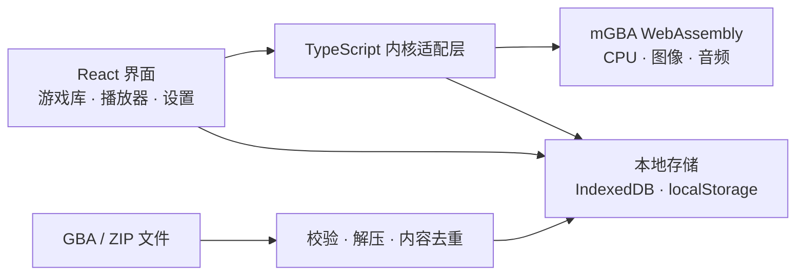

<div align="center">


# Advance

**你的掌机游戏空间。**

一个现代、美观的 GBA 浏览器模拟器。真实 mGBA 内核，本地游戏库，随时保存，再次出发。

[](LICENSE)
[](public/emulator/NOTICE.md)
[](https://react.dev/)
[](https://www.typescriptlang.org/)

[效果预览](#效果预览) · [功能特性](#功能特性) · [快速开始](#快速开始) · [部署](#构建与部署) · [Roadmap](ROADMAP.md) · [参与贡献](CONTRIBUTING.md) · [English](README.en.md)

</div>


Advance 把熟悉的掌机体验带到浏览器：整理游戏、连接手柄、回到刚才的存档，或在手机上继续探索。界面采用中文设计，适配桌面、平板与手机；游戏由 **mGBA WebAssembly** 核心实际执行，包含图像、声音与游戏内存档。

无需账号，也无需自行提供 BIOS。仓库附带 MIT 授权的原创 GBA 小游戏 **Star Orbit · 星际漫游**，启动后点击「开始试玩」即可体验。商业游戏 ROM 不随项目分发。

## 效果预览

以下均为实际界面截图，游戏画面来自仓库内的原创试玩 ROM。除上方游戏库首页外，还展示存档、控制器、设置、帮助和移动端等主要界面。

### 1. 存档管理与即时存档

存档管理页集中展示各游戏的自动与手动存档，包括画面预览、保存时间，以及继续游戏、导出和删除操作。


游戏内的即时存档面板提供 **1 个自动槽与 5 个手动槽**，可保存、读取、导入和导出即时存档，也可备份或导入游戏内的 `.sav` 存档。

<p align="center">
  <a href="docs/images/save-states.png"></a>
</p>

### 2. 控制器与模拟器设置

| 控制器设置 | 模拟器设置 |
| :---: | :---: |
|  |  |
| 点击键位重新映射，支持恢复默认；可切换触屏按键显示。 | 选择画面风格、1× / 2× / 4× 速度、游戏音量与自动存档，偏好自动保存。 |

### 3. 帮助与快捷键

内置使用指南涵盖 GBA / ZIP 导入、键盘操作与存档方式，并集中列出暂停、快速存取档、快进、倒带和全屏快捷键。

<p align="center">
  <a href="docs/images/help-shortcuts.png"></a>
</p>

### 4. 游戏播放与画面风格

| 原生像素 | 复古 CRT |
| :---: | :---: |
|  |  |
| 播放控制、快速存取档、倍速、截图和全屏操作集中在画面下方。 | 在设置中切换 CRT 扫描线，也可选择原生像素或柔和平滑显示。 |

### 5. 收藏与游戏库列表

在「我的收藏」中集中查看喜欢的游戏；列表视图显示游戏信息与游玩记录，并保留搜索、排序和启动入口。


### 6. 手机触控

移动端布局提供方向键、A / B、L / R、Start / Select 等触屏控件，播放工具栏也可直接操作。

<p align="center">
  <a href="docs/images/mobile-player.png"></a>
</p>

## 功能特性

| 模块 | 已实现功能 |
| --- | --- |
| **真实模拟** | mGBA WASM 核心；GBA 画面、音频与 SRAM / Flash / EEPROM 游戏内存档 |
| **游戏库** | 多文件与拖放导入；搜索、排序、网格 / 列表、收藏、最近游玩、累计时长、删除 |
| **ZIP 导入** | 自动读取子目录中的 `.gba`；一次导入多款游戏；SHA-256 内容去重，保留已有收藏与进度 |
| **即时存档** | 5 个手动槽 + 1 个自动槽；画面预览；快速存取档；mGBA 即时存档导入 / 导出 |
| **进度管理** | 开启自动保存后，每 30 秒及返回游戏库、切入后台时保存，并在下次启动恢复；支持 `.sav` 导入 / 导出 |
| **播放控制** | 暂停、继续、重置、全屏；1× / 2× / 4× 速度；按住快进与倒带；音量、静音 |
| **输入方式** | 可重映射键盘、标准映射手柄（十字键 / 左摇杆）、触屏虚拟手柄 |
| **画面风格** | 原生像素、平滑缩放、CRT 扫描线；下载真实核心帧缓冲截图 |
| **本地存储** | ROM、游戏信息与存档存入 IndexedDB；偏好存入 localStorage；应用运行时不依赖外部 CDN |
| **原创试玩** | 可复现构建的 ARM 程序，包含双缓冲画面、原生按键、PSG 音效与 SRAM 存档 |

## 快速开始

推荐 **Node.js 24** 与 **pnpm 11.19.0**（最低 Node.js 22.18）。如尚未安装 pnpm，先运行 `npm install --global pnpm@11.19.0`。

```sh
git clone https://github.com/hehuang139/gba-emu.git
cd gba-emu
pnpm install --frozen-lockfile
pnpm dev
```

打开 [http://localhost:5173](http://localhost:5173)，点击「开始试玩」，或导入自己的 `.gba` / `.zip` 文件。

**Star Orbit 玩法**：方向键移动飞船，靠近金色信标得分；`X` 推进、`Z` 发出脉冲、`Enter` 清零并重新开始。它运行在模拟器内核中；[试玩说明与构建源码](public/demo/README.md)可以帮助你了解一个最小 GBA 程序如何工作。

## 默认操作

点击游戏画面后，键盘控制生效。按 `Esc` 或 `Shift + Tab` 可离开游戏焦点，继续操作界面。GBA 按键可在「控制器设置」中重新映射。

| 操作 | 默认按键 |
| --- | --- |
| 方向 | `↑` `↓` `←` `→` |
| GBA A / B | `X` / `Z` |
| GBA L / R | `A` / `S` |
| Start / Select | `Enter` / 右 `Shift` |
| 暂停 / 继续 | `Space` |
| 保存 / 读取手动槽 1 | `F5` / `F8` |
| 临时 2× 快进 | 按住 `Tab` |
| 倒带 | 按住 `Backspace` |
| 全屏 | `F11` |

标准手柄支持 A / B、L / R、Start / Select、十字键和左摇杆。浏览器通常需要先按一次手柄按钮才能识别；非标准映射手柄暂不支持。移动端可使用触屏控件，也可在设置中切换显示。

## ROM 与存档

### 支持的导入格式

| 项目 | 当前范围 |
| --- | --- |
| 单个 `.gba` | 192 B–32 MiB |
| `.zip` 文件 | 最大 64 MiB；支持 Stored / Deflate |
| ZIP 内游戏 | 最多 32 个；解压后的 ROM 总大小不超过 128 MiB |
| 子目录与重复文件 | 递归识别 `.gba`，忽略说明文档与 macOS 元数据；同内容游戏自动合并 |
| 不支持的压缩格式 | 加密 ZIP、ZIP64、分卷与嵌套 ZIP；其他格式请先在本机解压 |

ZIP 导入会检查文件大小与 CRC。原有游戏被再次导入时，收藏、游戏时长与存档会保留。

### 两种存档有什么区别？

- **游戏内存档 `.sav`**：游戏自身的保存进度，例如在游戏菜单选择「保存」产生的数据。导入后会重新启动游戏，并刷新自动存档。
- **即时存档**：包含画面对应时刻的完整模拟状态，可从任意时刻继续。请使用同一游戏、兼容 mGBA 版本生成的文件。

浏览器清理站点数据、无痕窗口关闭或存储空间回收可能移除本地文件；重要进度请通过导出功能备份。强制结束浏览器时，上次自动保存之后的进度可能丢失。

## 构建与部署

```sh
pnpm build
pnpm preview
```

构建结果位于 `dist/`，本地预览地址为 [http://localhost:4173](http://localhost:4173)。

**mGBA 使用 WebAssembly 线程，部署必须满足跨源隔离要求。** 使用 HTTPS（本地开发可用 localhost），并在响应中添加：

```http
Cross-Origin-Opener-Policy: same-origin
Cross-Origin-Embedder-Policy: require-corp
```

Vite 开发与预览服务已配置上述响应头；`public/_headers` 会随构建输出，适用于支持该格式的 Netlify / Cloudflare Pages 静态部署。其他服务需要自行配置响应头，并将内核资源与应用放在同一源下。

<details>
<summary>Nginx 配置示例</summary>

```nginx
server {
    listen 443 ssl;
    # 在此配置你的域名和 TLS 证书
    root /var/www/advance/dist;

    add_header Cross-Origin-Opener-Policy same-origin always;
    add_header Cross-Origin-Embedder-Policy require-corp always;

    location / {
        try_files $uri $uri/ /index.html;
    }
}
```

</details>

目前默认部署在站点根目录。普通 HTTP 局域网地址、缺少隔离响应头的静态托管不能启动内核；默认 GitHub Pages 无法配置此处所需的自定义响应头，不适合直接部署当前版本。

浏览器需支持 SharedArrayBuffer、WebAssembly 线程、WebGL 和 IndexedDB。首次访问需要加载应用资源，当前未提供 PWA 离线安装。

## 工作原理



应用负责交互、资源管理与存档持久化，mGBA 负责硬件模拟。内核文件随仓库分发，核心版本及本地桥接修改见 [mGBA 来源说明](public/emulator/NOTICE.md)。

<details>
<summary>项目结构</summary>

```text
src/App.tsx                 游戏库、播放器、设置与存档界面
src/styles.css              桌面与移动端样式
src/components/Artwork.tsx  原创掌机与封面插画
src/emulator/index.ts       内核适配、生命周期与输入
src/lib/storage.ts          IndexedDB 存储与去重
src/lib/import-roms.ts      ZIP 校验与限额解压
src/lib/preferences.ts      偏好与默认按键
public/emulator/            固定版本核心、许可证与来源
public/demo/                原创试玩 ROM、截图与说明
public/fonts/               本地字体与许可证
scripts/create-demo.mjs     ARM 指令生成与试玩 ROM 构建
scripts/test-*.mjs          真实浏览器集成检查
docs/images/                项目首页截图
```

</details>

## 验证与开发

```sh
pnpm test
pnpm build
pnpm exec playwright install chromium

# 保持另一终端中的 pnpm dev 运行
pnpm test:engine
pnpm test:ui
pnpm test:zip
pnpm test:saves
```

| 检查 | 覆盖范围 |
| --- | --- |
| 存储与 ZIP 单元测试 | 内容去重、并发更新、存档覆盖、级联删除、损坏检测、存储异常与 ZIP 校验 |
| 真实内核检查 | ROM 画面、输入位移、状态恢复、倒带、倍速、SRAM 与 worker 释放 |
| 界面流程 | 收藏、搜索、试玩、快速存取档、下载、键位设置、导入、刷新恢复与移动触控 |
| ZIP 导入流程 | 多游戏、子目录、去重、拖放、错误提示与解压后的游戏启动 |
| 存档流程 | `.sav` 导入后立即刷新、自动存档一致性与跨游戏存档隔离 |

浏览器测试默认连接 `http://127.0.0.1:5173`。环境变量、测试约定与贡献流程见 [CONTRIBUTING.md](CONTRIBUTING.md)。测试使用原创试玩 ROM；尚未进行完整商业 ROM 兼容性测试，单个游戏的实际表现仍需验证。

## Roadmap

当前版本已提供游戏导入、实际模拟、存取档与多种输入方式。下一步重点如下，均为**尚未完成的规划**：

- [ ] 增加浏览器与移动设备兼容性矩阵，以及可复现的性能检查。
- [ ] 改进触屏布局、自定义手柄映射与键盘可访问性。
- [ ] 提供游戏库及存档批量备份 / 恢复。
- [ ] 探索具备跨源隔离支持的 PWA 安装与离线体验。
- [ ] 增加界面国际化与更多可合法分发的自制 ROM 测试。

优先级、验收方向与待评估功能见 [完整 Roadmap](ROADMAP.md)，已发布版本的变化见 [更新日志](CHANGELOG.md)。目前不支持联机、作弊码、云同步或 GB / GBC；路线图不代表这些功能已可用，也不承诺发布日期。

## 参与贡献

欢迎提交 Bug、改进交互、完善文档或增加测试。请先阅读 [贡献指南](CONTRIBUTING.md)，提交问题时附上浏览器版本、复现步骤与错误信息。可通过 [Issues](https://github.com/hehuang139/gba-emu/issues) 讨论建议，通过 [Pull requests](https://github.com/hehuang139/gba-emu/pulls) 提交改动。

请勿在 Issue、PR 或测试资源中上传无权分发的游戏 ROM、BIOS 或素材。原创试玩及有明确再分发许可的自制游戏更适合用于复现和测试。

## 鸣谢

Advance 建立在以下开源项目与创作者的工作之上：

| 项目 | 用途 |
| --- | --- |
| [mGBA](https://mgba.io/) · Jeffrey Pfau 与贡献者 | GBA 硬件模拟核心 |
| [mgba-wasm](https://github.com/thenick775/mgba) · Nicholas VanCise 与贡献者 | mGBA 的 WebAssembly 移植与浏览器接口 |
| [React](https://react.dev/) · [TypeScript](https://www.typescriptlang.org/) · [Vite](https://vite.dev/) | 应用界面、类型系统与构建工具 |
| [Lucide](https://lucide.dev/) | 界面图标 |
| [fflate](https://github.com/101arrowz/fflate) | ZIP 解压 |
| [DM Sans](https://github.com/googlefonts/dm-fonts) | 界面字体 |
| [Playwright](https://playwright.dev/) · [fake-indexeddb](https://github.com/dumbmatter/fakeIndexedDB) | 浏览器集成检查与存储测试 |

也感谢为掌机模拟、自制游戏与浏览器开放技术作出贡献的开发者。

## 许可证

应用代码与原创试玩采用 [MIT 许可证](LICENSE)。**第三方组件保留各自许可证**：mGBA / mgba-wasm 及本地核心桥接修改采用 MPL-2.0，DM Sans 字体采用 SIL OFL 1.1。分发时应保留相应许可证与来源说明，详见 [第三方声明](THIRD_PARTY_NOTICES.md)。

Game Boy Advance 是 Nintendo 的商标。本项目是独立开源项目，与 Nintendo 无关联，也未获其背书。
